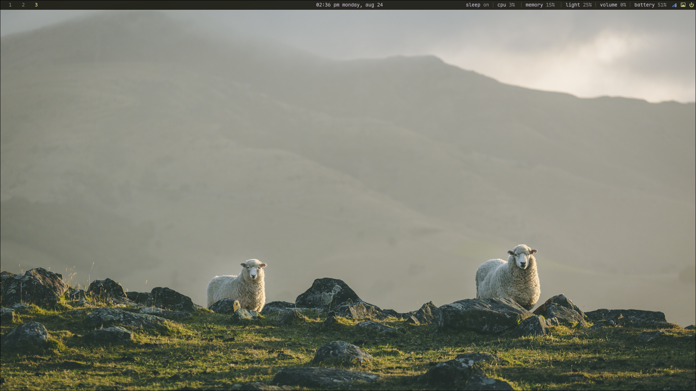
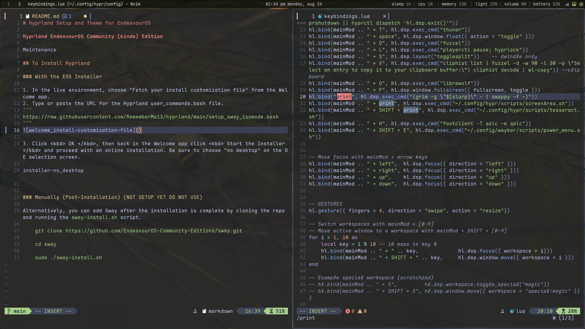

# Hyprland Setup and Theme for EndeavourOS

**Hyprland EndeavourOS Community (kinda) Edition**

[]()

## To Install Hyprland

### With the EOS Installer

1. In the live environment, choose "Fetch your install customization file" from the Welcome app.
2. Type or paste the URL for the Hyprland user_commands.bash file.
```
https://raw.githubusercontent.com/RememberMe13/hyprland/main/setup_sway_isomode.bash
```

# Screenshots


